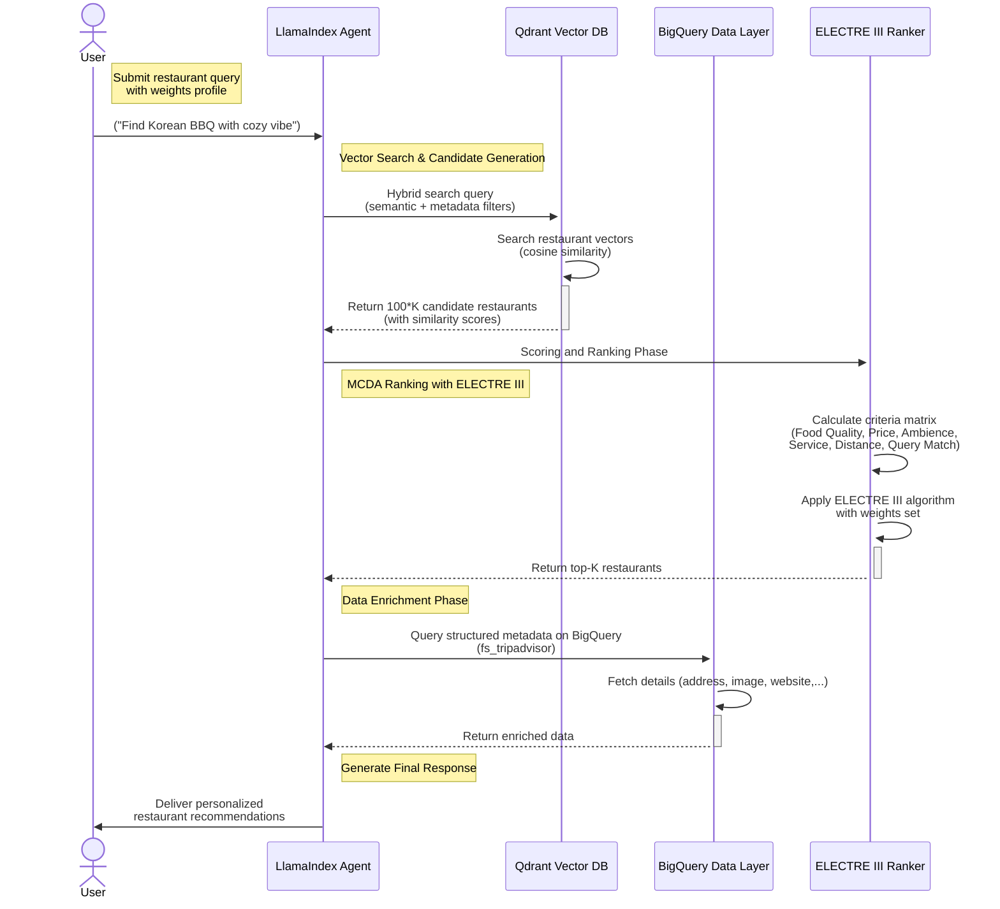

# 🍽️ TripAdvisor Foodbot

  

https://github.com/user-attachments/assets/2eefc1b1-018f-4249-88d9-f9b9f606d761

## 📝 Overview

> [!NOTE]
>
> 📦 Data for this project is sourced from repositories in the [`include`](include/) directory. It is scraped, processed, and cleaned using multiple modules. The `dm_tripadvisor` and `fs_tripadvisor` datasets are publicly available in BigQuery for authenticated users and power the restaurant recommendation system.

A next-generation restaurant recommendation system implementing **RAG (Retrieval-Augmented Generation)** architecture with **vector search** and **multi-criteria decision analysis (MCDA - ELECTRE III)**. Built on LlamaIndex for agent orchestration, Qdrant for vector storage, and BigQuery for data operations.

---

## 🚀 Core Components

- Vector Search: Qdrant with FastEmbed for dense retrieval
- MCDA Engine: ELECTRE III implementation for ranking restaurants
- LLM Integration: OpenAI API with streaming response to generate final natural responses
- Data Layer: BigQuery for structured data + Qdrant collections
- Agent Framework: LlamaIndex with custom tools and callbacks

---

## ⚙️ Technical Implementation

### Vector Search Pipeline

- FastEmbed for dense embeddings generation
- Qdrant collections for restaurant vectors
- Hybrid search combining semantic and metadata filtering

### MCDA Implementation

- **ELECTRE III** algorithm for restaurant ranking
- Custom concordance/discordance thresholds
- Multi-criteria evaluation:
  - Food quality (delicious, fresh, etc.)
  - Price sensitivity (affordable, expensive, etc.)
  - Ambience (quiet, cozy, etc.)
  - Service (friendly, fast, polite, etc.)
  - Distance to user location (using distance mapping)
  - Query matching (using `cosine similarity`)

> Pre-processing before ranking: Convert review sentiment (positive, negative, etc.) to numerical scores, then apply ELECTRE III to rank restaurants based on user preferences.

> [!IMPORTANT]
>
> ⚡ Because **ELECTRE III** is a **decision analysis** algorithm calculated based on lots of matrix operations, it can take significant time to rank restaurants with `numpy`. To improve performance and user experience, we use `numba` to speed up the ranking process by compiling the `numpy`-based functions with `njit` (`@njit` - alias for `@jit(nopython=True)`). This enables our Python functions to run at near-C speed.

---

### 📁 Repository Structure

```bash
src/
├── bigquery/    # BigQuery operations and data handlers
├── chat/        # LlamaIndex agent implementation
├── helper/      # Utility functions
├── qdrant/      # Vector DB operations
├── ranker/      # ELECTRE III implementation
└── s3/          # S3 client for asset storage (user storage)
```

---

### 🤖 Agent Implementation - `chat` Directory

- LlamaIndex RAG implementation
- Custom tools for:
  - `candidate_generation_and_ranking`: generate candidate restaurants and rank them using MCDA
  - `enrich_restaurant_recommendations`: enrich recommendations with more information and generate the final natural response
- Streaming response handlers for tool callbacks
- Context management with chat history



---

## 🛠️ Development Setup

### 📋 Requirements

- 🐍 `python ~= 3.11`
- 📦 `uv` package manager (for python deps)
- 🌐 `npx` (for `prisma` CLI)
- 🔑 OpenAI API key: [OpenAI Console](https://platform.openai.com/) (Mandatory)
- ☁️ GCP account with BigQuery: [GCP Console](https://console.cloud.google.com/) (Optional, you can use local storage)
- 🟣 Qdrant Cloud instance: [Qdrant Console](https://cloud.qdrant.io/) (Optional, you can use my docker containers)
- 🗄️ AWS S3 (or alternative storage service using S3 API) (Optional, you can use my docker containers)

---

### ⚡ Quick Start

> [!NOTE]
>
> For local development, you can use the provided Docker containers for Qdrant and S3. If you want to use remote services, you can set up your own Qdrant and S3 instances or use the provided credentials in the `.env` file.
>
> - For remote services, if you want to use BigQuery, you must put the `sa.json` (service account JSON file) in the root directory and set the `FEATURE_STORAGE_MODE` to `remote` in the `src/helper/vars.py` file. If you want to use local storage, set it to `local`.
> - For Qdrant and S3, you can set the `QDRANT_*` and `*_AWS_*` environment variables in the `.env` file to your remote service credentials.

1. **Install dependencies with `uv`**

   ```bash
   uv sync
   ```

1. **Set up environment variables**

   Copy the `.env.example` file to `.env` and fill in the required values:

   ```bash
   cp .env.example .env
   ```

   Change the `OPENAI_API_KEY` to your OpenAI API key.

1. **Start containers (optional - ignore if using remote services)**

   If you want to use local Qdrant and S3, you can start the containers using `docker-compose`:

   ```bash
   docker compose up -d
   ```

   This will start Qdrant and S3-compatible storage services locally (MinIO). Make sure you have Docker installed and running. If you want to use remote services, you can skip this step.

1. **Initialize Qdrant collections**

   If you are using Qdrant, you need to initialize the collections. You can do this by running the following command:

   ```bash
   make load_qdrant
   ```

   This will create the necessary collections in Qdrant and load the initial data.

1. **Initialize Chatbot Schema (Prisma)**

   Because we are using Prisma for the storage of the chatbot schema, you need to run the following command to generate the Prisma client and apply the schema migrations:

   ```bash
   make db
   ```

   This will generate the Prisma client and apply the schema migrations.

   > Change the `DATABASE_URL` in the `.env` file to your database connection string if you are using a remote database.

1. **Start development server**

   ```bash
   make run
   ```

Check your `http://localhost:8000` for the LlamaIndex agent UI.

---

### 📦 Dependencies

This project uses `uv` as the package manager. Dependencies are managed in the `uv` configuration file (`pyproject.toml`).

- Core: `llama-index`, `fastembed`, `qdrant-client`
- Data: `google-cloud-bigquery`, `pandas`
- UI: `chainlit`

---

## 📄 License

This project is licensed under the MIT License - see the [LICENSE](LICENSE) file for details.

---
